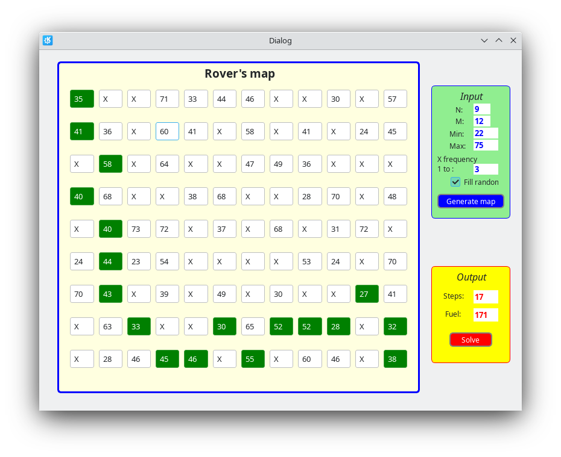

# KDE-Dijkstra-algorithm-with-Path

**A task**

You are an engineer designing rovers. You need to design the rover's path over known terrain with maximum battery savings.

**Terrain**

Terrain data comes in the form of a matrix with non-negative numbers or X for those cells that cannot be used. Matrix size NxM.
The numbers show the height above sea level. X is a cell on which movement is impossible.

**Rover**

The rover always moves from the upper left point [0][0] to the lower right point [N - 1][M - 1], where N and M are the length and width of the matrix.
Your rover has several limitations:

1. Movement
From any point, the rover can move in eight directions: north, south, west, east, southwest, southeast, northeast, northwest.
2. Charge
The rover is on charge. You know that it is very costly for a rover to go up and down. It spends one charge to move, and additional charges to ascend and descend.
3. Charge consumption
The charge is consumed according to the rule:
For 1 step, the rover always spends 1 unit of charge. Ascending or descending the rover consumes a charge proportional to the difficulty of the ascent or descent.
The difficulty of climbing or descending is the difference between the altitudes. For every second diagonal, the rover spends an additional unit of charge.

The goal is to calculate the path of the rover from the upper left [0][0] point to the lower right [N - 1][M - 1] point with minimal charge consumption.

